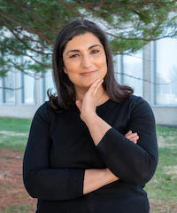
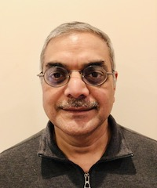

KDD Trustworthy AI Day 2022 will take place on **August 15, 2022, 8am-5pm PST**. 

<table class="tg">
<tbody>
  <tr>
    <th class="tg-feht">8:30am</th>
    <th class="tg-feht">8:40am</th>
    <th class="tg-feht">Opening Remarks</th>
    <th class="tg-feht"></th>
  </tr>
  <tr>
    <td class="tg-73oq">8:40am</td>
    <td class="tg-73oq">9:40am</td>
    <td class="tg-73oq">Keynote #1</td>
    <td class="tg-73oq">
      <a href="https://www.nist.gov/people/elham-tabassi">
      Elham Tabassi</a> (NIST - Chief of Staff, Information Technology Laboratory)
       &nbsp;&nbsp;<em>Title: TBD</em> (<a href="#Elham_Tabassi">&#128279;</a>)
       *Session Chair: Wei Wang (UCLA)*
    </td>
  </tr>
  <tr>
    <td class="tg-65px">9:30am</td>
    <td class="tg-65px">10:00am</td>
    <td class="tg-65px">Coffee Break</td>
    <td class="tg-65px"></td>
  </tr>
  <tr>
    <td class="tg-73oq">10:00am</td>
    <td class="tg-73oq">11:05am</td>
    <td class="tg-73oq">Invited Talks</td>
    <td class="tg-73oq">
      <a href="https://www.nist.gov/people/brian-stanton">Brian Stanton</a> (NIST - Project Lead for AI User Trust)
       &nbsp;&nbsp;<em>Title: TBD</em> (<a href="#Brian_Stanton">&#128279;</a>)
        <a href="https://www.linkedin.com/in/davidjamesmarcos/">David James Marcos</a> (Microsoft - Director, Governance & Enablement: Office of Responsible AI)
       &nbsp;&nbsp;<em>Title: TBD</em> (<a href="#David_Marcos">&#128279;</a>)
        <a href="https://researcher.watson.ibm.com/researcher/view.php?person=us-dverma">Dinesh Verma</a> (IBM Research - CTO for Edge computing)
       &nbsp;&nbsp;<em>Title: Trusting the outcomes of AI models: Experiences from Applications of AI in IoT Solutions</em> (<a href="#Dinesh_Verma">&#128279;</a>)
        <a href="https://www.cs.memphis.edu/~santosh/">Santosh Kumar</a> (U. Memphis - Director, NIH NIBIB mHealth Center 
       for Discovery, Optimization, and Translation of Temporally-Precise Interventions)
       &nbsp;&nbsp;<em>Title: TBD</em> (<a href="#Santosh_Kumar">&#128279;</a>)
        *Session Chair: Yizhou Sun (UCLA)*</td>
    <td class="tg-73oq"></td>
  </tr>
  <tr>
    <td class="tg-vwhn">11:05pm</td>
    <td class="tg-vwhn">12:00pm</td>
    <td class="tg-vwhn">Panel Discussion</td>
    <td class="tg-vwhn">Panelists: Elham Tabassi, Brian Stanton, David James Marcos, Dinesh Verma, Santosh Kumar *Panel Moderator: Yizhou Sun (UCLA)*</td>
  </tr>
  <tr>
    <td class="tg-65px">12:00pm</td>
    <td class="tg-65px">1:00pm</td>
    <td class="tg-65px">Lunch</td>
    <td class="tg-65px"></td>
  </tr>
  <tr>
    <td class="tg-73oq">1:00pm</td>
    <td class="tg-73oq">2:00pm</td>
    <td class="tg-73oq">Keynote #2</td>
    <td class="tg-73oq">
      <a href="https://sites.google.com/view/jpei/jian-peis-homepage">Jian Pei</a> (Duke University)
       &nbsp;&nbsp;<em>Title: TBD</em> (<a href="#Jian_Pei">&#128279;</a>)
       *Session Chair: Wei Wang (UCLA)*</td>
  </tr>
  <tr>
    <td class="tg-73oq">2:00pm</td>
    <td class="tg-73oq">3:00pm</td>
    <td class="tg-73oq">Invited Talks</td>
    <td class="tg-73oq">
      <a href="http://qveraliao.com/">Q. Vera Liao</a> (Microsoft Research Montréal)
       &nbsp;&nbsp;<em>Title: TBD</em> (<a href="#Vera_Liao">&#128279;</a>)
        <a href="https://www.james-zou.com/">James Zou</a> (Stanford University)
       &nbsp;&nbsp;<em>Title: TBD</em> (<a href="#James_Zou">&#128279;</a>)
        <a href="http://jpdickerson.com/">John P. Dickerson</a> (University of Maryland)
       &nbsp;&nbsp;<em>Title: TBD</em> (<a href="#John_Dickerson">&#128279;</a>)
       *Session Chair: Alexandra Chouldechova (CMU)*</td>
  </tr>
  <tr>
    <td class="tg-65px">3:00pm</td>
    <td class="tg-65px">3:30pm</td>
    <td class="tg-65px">Coffee Break</td>
    <td class="tg-65px"></td>
  </tr>
  <tr>
    <td class="tg-73oq">3:30pm</td>
    <td class="tg-73oq">4:10pm</td>
    <td class="tg-73oq">Invited Talks</td>
    <td class="tg-73oq">
      <a href="https://iddp.gwu.edu/susan-ariel-aaronson">Susan Aaronson</a> (George Washington University)
       &nbsp;&nbsp;<em>Title: TBD</em> (<a href="#Susan_Aaronson">&#128279;</a>)
        <a href="https://www.karen-levy.net/">Karen Levy</a> (Cornell University)
       &nbsp;&nbsp;<em>Title: TBD</em> (<a href="#Karen_Levy">&#128279;</a>)
        <a href="https://annewashington.com/">Anne Washington</a> (New York University)
       &nbsp;&nbsp;<a href="#Anne_Washington">Title</a>
       &nbsp;&nbsp;<em>Title: TBD</em> (<a href="#Anne_Washington">&#128279;</a>)
       *Session Chair: Alexandra Chouldechova (CMU)*</td>
  </tr>
  <tr>
    <td class="tg-vwhn">4:10pm</td>
    <td class="tg-vwhn">5:00pm</td>
    <td class="tg-vwhn">Panel Discussion</td>
    <td class="tg-vwhn">
      Panelists: Jian Pei, Q. Vera Liao, James Zou, John P. Dickerson,
       Susan Aaronson, Karen Levy, Anne Washington
       *Panel Moderator: Alexandra Chouldechova (CMU)*
    </td>
  </tr>
  <tr>
    <td class="tg-feht">5:00pm</td>
    <td class="tg-feht"></td>
    <td class="tg-feht">Closing Remarks</td>
    <td class="tg-feht"></td>
  </tr>
</tbody>
</table>

 
 
 
# Talk and Speaker Details 

## Elham Tabassi

> **Title:** TBD

> **Abstract:** TBD

> **Biography:** TBD

## Brian Stanton

> **Title:** TBD

> **Abstract:** TBD

> **Biography:** TBD

## David James Marcos

> **Title:** TBD

> **Abstract:** TBD

> **Biography:** TBD

## Dinesh Verma

> **Title:** Trusting the outcomes of AI models: Experiences from Applications of AI in IoT Solutions

> **Abstract:** Although the applications of AI and Machine Learning holds the promise of significant improvements in creating IoT solutions, a careless application of AI may do more harm than good.  Application of AI needs to be done with a careful understanding of the assumptions underlying the data for training, and exploring the differences in the training environment and the operational environment. In the course of deploying AI based solutions to tasks such as detection of IoT devices in the network, or in the use of acoustics for various IoT solutions, we came across several challenges in making AI based solutions work in a reliable and trustworthy manner.  On those experiences, we have drawn up a set of best practices for use of AI technologies in IoT solutions to develop resilient and trustworthy solutions. We believe these best practices should generalize to applications of AI in general, and would provide an overview of the same in the talk.

> **Biography:** Dinesh C. Verma is a Fellow of UK Royal Academy of Engineering, an IEEE Fellow and an IBM Fellow. Currently, he is working as the Chief Scientist of the Research Consulting Program with a focus on US Public Sector. He has authored 11 books, 150+ technical papers and 185+ U.S. patents. He has chaired/vice-chaired IEEE technical committee on computer communications, as well as IEEE Internet technical committee. He has served on various program committees and editorial boards. He is a member of the IBM Academy of Technology, an IBM Master Inventor, and won several IBM internal technical awards. He has contributed to several IBM products and service offerings including significant contributions to server networking stack, network management products, edge computing and cellular network analytics. He has led several multi-national multi-organizational research programs. More details about Dinesh can be seen at [http://ibm.biz/dineshverma](http://ibm.biz/dineshverma)

## Santosh Kumar

> **Title:** TBD

> **Abstract:** TBD

> **Biography:** TBD

## Jian Pei

> **Title:** TBD

> **Abstract:** TBD

> **Biography:** TBD

## Q. Vera Liao

> **Title:** TBD

> **Abstract:** TBD

> **Biography:** TBD

## James Zou

> **Title:** TBD

> **Abstract:** TBD

> **Biography:** TBD

## John P. Dickerson

> **Title:** TBD

> **Abstract:** TBD

> **Biography:** TBD

## Susan Aaronson

> **Title:** TBD

> **Abstract:** TBD

> **Biography:** TBD

## Karen Levy

> **Title:** TBD

> **Abstract:** TBD

> **Biography:** TBD

## Anne Washington

> **Title:** TBD

> **Abstract:** TBD

> **Biography:** TBD